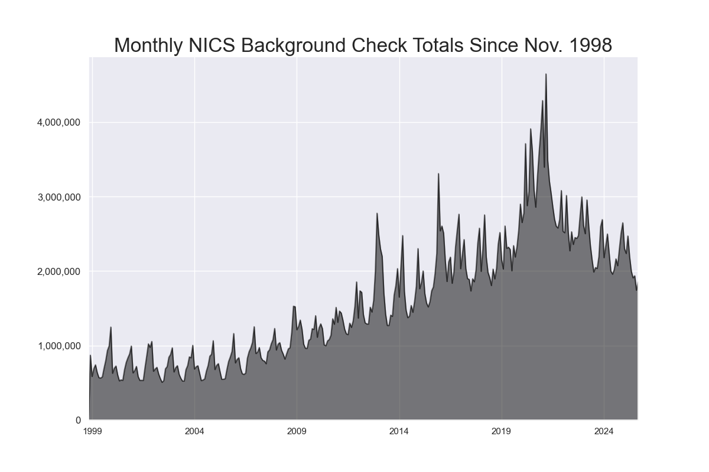
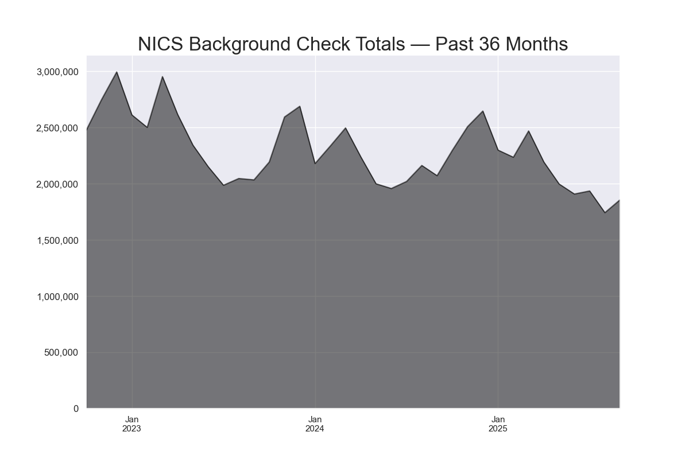

# *Notes on this fork*

*This fork adds NSSF®-Adjusted numbers to the [upstream](https://github.com/data-liberation-project/nics-firearm-background-checks)'s monthly data from the FBI's National Instant Criminal Background Check System. The upstream author [declined](https://github.com/BuzzFeedNews/nics-firearm-background-checks/pull/9) to merge this fork because any non-FBI data are out of scope for that project. Thus, this fork is maintained separately from its upstream.*

## *Disclaimer*

*This fork is in no way sponsored, endorsed, approved, or associated with [NSSF](https://www.nssf.org/). It gathers only publicly-accessible data.*

## *NSSF Sources*

*The bulk of these data came from [Trump’s Numbers, Preelection Update](https://www.factcheck.org/2020/10/trumps-numbers-preelection-update/) ([archived](https://web.archive.org/web/20210425195106/https://www.factcheck.org/2020/10/trumps-numbers-preelection-update/)), specifically the apparently genuine [spreadsheet](https://cdn.factcheck.org/UploadedFiles/NSSFAdjustedNICSMonthlyHistory-1.xlsx) ([archived](https://web.archive.org/web/20210425195106/https://cdn.factcheck.org/UploadedFiles/NSSFAdjustedNICSMonthlyHistory-1.xlsx) and [included](data/NSSFAdjustedNICSMonthlyHistory-1.xlsx?raw=true) in this fork) containing NSSF®-Adjusted numbers from `2000-01` through `2020-09`. That page's attribution footnote describes its source as "Proprietary data supplied on request and posted with NSSF permission. 5 Oct 2020."*

*Other months' numbers have become available month-by-month, as various (apparently) first-hand recipients mentioned them in their press releases or media coverage, which were then indexed by search engines. Those mentions supplied the data from `1998-11` through `1999-12`, and from `2020-10` to current.*

## *NSSF Methodology*

*In a [blog post](https://www.nssf.org/articles/gun-control-group-tracking-nics-checks-badly/) ([archived](https://web.archive.org/web/20210712130908/https://www.nssf.org/articles/gun-control-group-tracking-nics-checks-badly/)), NSSF describes its methodology:*

> *NSSF’s adjustments are derived by subtracting out NICS purpose code permit checks and permit rechecks used by states for concealed carry permit application checks as well as checks on active concealed carry permit databases... Twenty-four (Apr 2025) states currently have at least one qualified alternative permit, which under the Brady Act allows the permit-holder, who has undergone a background check to obtain the permit, to purchase a firearm from a licensed dealer without a separate additional background check for that transfer. The number of NICS checks in these states does not include these legal transfers based on qualifying permits and NSSF does not adjust for these transfers.*

# FBI NICS Firearm Background Check Data

The data in this repository comes from the [FBI's National Instant Criminal Background Check System](https://www.fbi.gov/about-us/cjis/nics).

> Mandated by the Brady Handgun Violence Prevention Act of 1993 and launched by the FBI on November 30, 1998, NICS is used by Federal Firearms Licensees (FFLs) to instantly determine whether a prospective buyer is eligible to buy firearms or explosives. Before ringing up the sale, cashiers call in a check to the FBI or to other designated agencies to ensure that each customer does not have a criminal record or isn’t otherwise ineligible to make a purchase. More than 100 million such checks have been made in the last decade, leading to more than 700,000 denials.

The FBI provides data on the number of firearm checks by month, state, and type — [but as a PDF](https://www.fbi.gov/file-repository/nics_firearm_checks_-_month_year_by_state_type.pdf/view). The code in this GitHub repository downloads that PDF, parses it, and produces a spreadsheet/CSV of the data. [__Click here to download the data__](data/nics-firearm-background-checks.csv?raw=true), which currently covers November 1998 – May 2025.

## Notes On The Data

The original PDF contains important notes and caveats. It's a good idea to read those first before diving into the data. Among the caveats is this important one — emphasis added:

> These statistics represent the number of firearm background checks initiated through the NICS. They do not represent the number of firearms sold. Based on varying state laws and purchase scenarios, __a one-to-one correlation cannot be made between a firearm background check and a firearm sale__.

A bit more background, [from *The Trace*](http://www.thetrace.org/2015/11/black-friday-gun-sales-background-checks/) in 2015:

> The FBI’s background check numbers come with caveats: As seen in the late February-early March 2014 bubble, many checks are for concealed carry permits, not actual gun sales. Kentucky runs a new check on each concealed carry license holder each month. And of course, the FBI’s numbers don’t include private gun sales, many of which do not require a background check. [...] Despite those vagaries, the FBI’s NICS numbers are widely accepted as the best proxy for total gun sales in a given time period.

That article mentions a forthcoming study, which ultimately was [published in February 2017 in the Annals of Internal Medicine](https://www.acpjournals.org/doi/10.7326/M16-1590). The study surveyed 1,613 adult gun owners in 2015. Approximately 29% had acquired their most recent gun within the past two years; of that subset, roughly 22% had done so without a background check — although that number varied substantially depending on the mode of acquisition and state laws.

Not all categories of background checks may be equally useful/pertinent to your research. When *The New York Times* [analyzed NICS data in Dec. 2015](http://www.nytimes.com/interactive/2015/12/10/us/gun-sales-terrorism-obama-restrictions.html), it included this methodological note:

> Note: Sales estimates are calculated from handgun, long gun and multiple-gun background checks. Permit checks and other categories of background checks are excluded. In California, multiple-gun checks were excluded because data was inconsistent. Because state laws differ, sales levels between states cannot be directly compared.

The authors of that *NYT* analysis [describe how they used the NICS data to estimate gun sales](https://github.com/NYTimes/gun-sales#getting-gun-sales-estimates-from-background-checks):

> To convert background checks into estimated sales, we relied on a method suggested in the [Small Arms Survey](http://www.smallarmssurvey.org/fileadmin/docs/F-Working-papers/SAS-WP14-US-Firearms-Industry.pdf) by Jurgen Brauer, a professor at Georgia Regents University. Each long gun and handgun check was counted as 1.1 sales. Each multiple-gun check was counted as two sales. Permit checks and other types of checks were omitted. The multiplier is an estimate based on Mr. Brauer's interviews with gun shop owners.

## Additional Resources

- [NICS Federal Firearms Licensee Manual](https://www.fbi.gov/file-repository/nics-firearms-licensee-manual-111811.pdf/view), which details the history and rules of the background-check program.

- [NICS Participation Map](https://www.fbi.gov/file-repository/nics-participation-map.pdf/view), which "depicts each state's level of participation with the NICS."

## Charts

## Run The Parser Yourself

All the necessary code is open-source. If you'd like to run the parser yourself, you'll need:

- Python 3.x
- The libraries listed in [`requirements.txt`](requirements.txt)

Then run `make all`. (See the [`Makefile`](Makefile) to view the individual commands.)

## Questions / Feedback / Improvements

File [an issue](issues), or email jsvine@gmail.com.

## Credits

This open-source repository was created by Jeremy Singer-Vine ([@jsvine](https://github.com/jsvine)) at BuzzFeed News in 2015. In 2023, [BuzzFeed News shut down](https://www.buzzfeednews.com/). In April 2024, Singer-Vine forked this repository to the [Data Liberation Project](https://www.data-liberation-project.org/)'s [GitHub organization](https://github.com/data-liberation-project).
